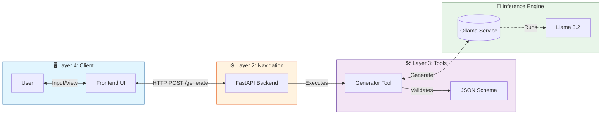

# 🚀 Local Test Case Generator (B.L.A.S.T. Protocol)

An agentic AI tool that generates comprehensive test cases from User Stories using a **Local LLM** (Llama 3.2) via Ollama. Built with privacy and determinism in mind, ensuring no data leaves your machine.

## 🏗️ Architecture

The system follows a strict 3-layer architecture to separate concerns and ensure reliability.



## ✨ Features

*   **🔒 Local & Private**: All processing happens on your machine using Ollama.
*   **⚡ Real-time UI**: Dark-themed, chat-like interface for easy interaction.
*   **📝 Structured Output**: Strictly formatted JSON test cases with Positive, Negative, and Edge case categorization.
*   **🛠️ Determinstic Tooling**: Python-based tool logic ensures consistent prompting and error handling.

## 📋 Prerequisites

*   [Ollama](https://ollama.com/) installed and running.
*   Python 3.10+
*   **Model**: `llama3.2` pulled (`ollama pull llama3.2`).

## 🚀 Quick Start

### 1. Start the System (Recommended)
We have included a "Turbo" script that sets up everything (Backend + Frontend) in the background.

```bash
chmod +x start_system.sh
./start_system.sh
```

**Access the App:**
*   **Frontend**: [http://localhost:3000](http://localhost:3000)
*   **Backend**: [http://localhost:8000](http://localhost:8000)

### 2. Manual Startup

**Backend:**
```bash
cd backend
pip install -r requirements.txt
uvicorn app:app --reload
```

**Frontend:**
```bash
cd frontend
python -m http.server 3000
```

## 📂 Project Structure

```
├── architecture/       # Layer 1: SOPs and Architecture definitions
├── backend/            # Layer 2: FastAPI Application
├── frontend/           # Layer 4: User Interface (Vanilla HTML/JS)
├── tools/              # Layer 3: Deterministic Python Tools
├── start_system.sh     # Deployment Script
├── BLAST.md           # Master System Prompt & Protocol
├── gemini.md           # Project Constitution (Data Schemas)
└── task_plan.md        # Execution Plan
```

## 🛡️ License

This project is part of the **AI Tester Blueprint** series.
